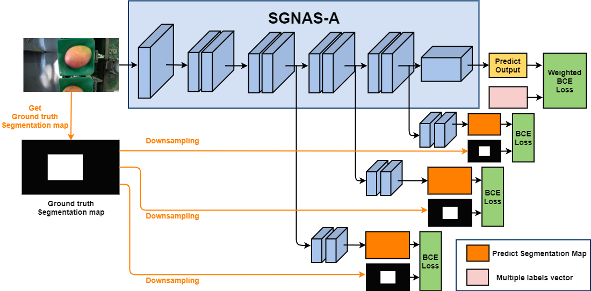

# AICUP_2020_愛文芒果不良品分類競賽
> Team Name : 一定達辰<br>
> Team Member : Dian-Shan Chen, Sian-Yao Huang<br>
> Public leaderboard / Private leaderboard : 0.7214973(3th/222) / 0.722768(3th/222)<br>

This repo is the entire codebase for the competition **AICUP_2020_愛文芒果不良品分類競賽**. The backbone of this repo is SGNAS-A, an architecture searched by SGNAS[1]. <br>




## Requirements
```
pip3 install -r requirements.txt
```
## Data prepare
```
mkdir data
mv C2_TrainDev.rar data && cd data
unrar x FileName.rar
```
## Pretrained weight of SGNAS-A
* Download pretrained weight from [Weight](https://drive.google.com/drive/folders/1vW6Ojd2ieusSHd7NmK3jDejLZG6s2Shc?usp=sharing)
```
mkdir pretrained
mv SGNAS_A_best.pth.tar pretrained
```

## Train
```
python3 train.py --cfg config_file/mango_config.yml --title [EXPERIMENT_TITLE]
```

## Inference
1. Push `Test_UploadSheet.csv` file in the root of this repo
```
mv Test_UploadSheet.csv ./
python3 test.py --cfg config_file/mango_config.yml --tta [TTA_NUMBER] --output-file [OUTPUT_FILE_PATH]
```

## Reference
[1] Sian-Yao Huang, Wei-Ta Chu. Searching by Generating: Flexible and Efficient One-Shot NAS with Architecture Generator.
